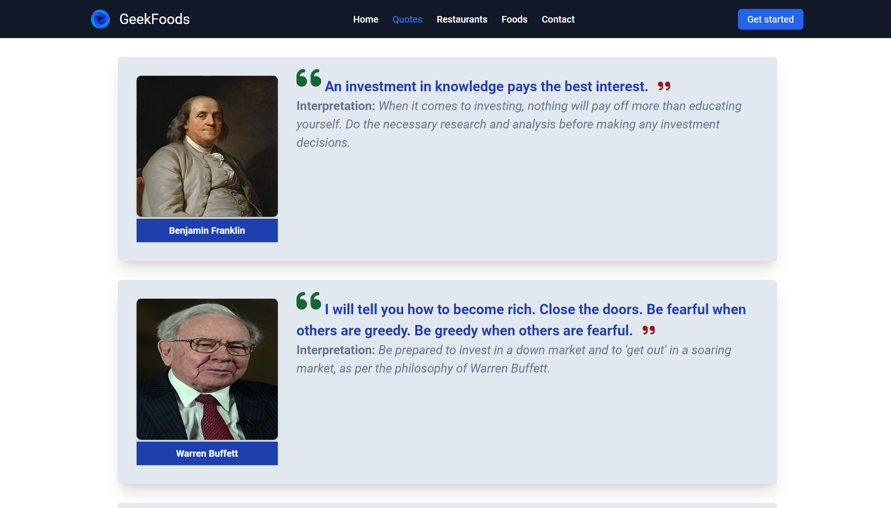

# M5React - Day 4 HomeWork List of Movies Cards


## Hosted Version of the Project:
[module5-react-day-4-homework-list-of-movies-cards](https://module5-react-day-4-homework-list-of-movies-cards.vercel.app/)

## Objective
In this project, i have built a dynamic ReactJS web page that utilizes JSON data to store and pass information to various components. JSON (JavaScript Object Notation) is a lightweight data interchange format that allows us to organize and manage structured data efficiently. here, i have created JSON data that includes image URLs, movie names, release years, durations in minutes, genres, and movie descriptions. By using JSON, i have centralized my data and seamlessly pass it to different components within our React application by using Props.

## How to install and run on yours local machine
```bash
npm install
npm run start
```

## Tech. Stack Used:
+ [React](https://react.dev/)
+ [Google Fonts](https://fonts.google.com/)
+ [Font Awesome](https://fontawesome.com/icons/)

## Author
[Abhishek kumar](https://www.linkedin.com/in/alex21c/), ([Geekster](https://geekster.in/) MERN Stack FS-14 Batch)


